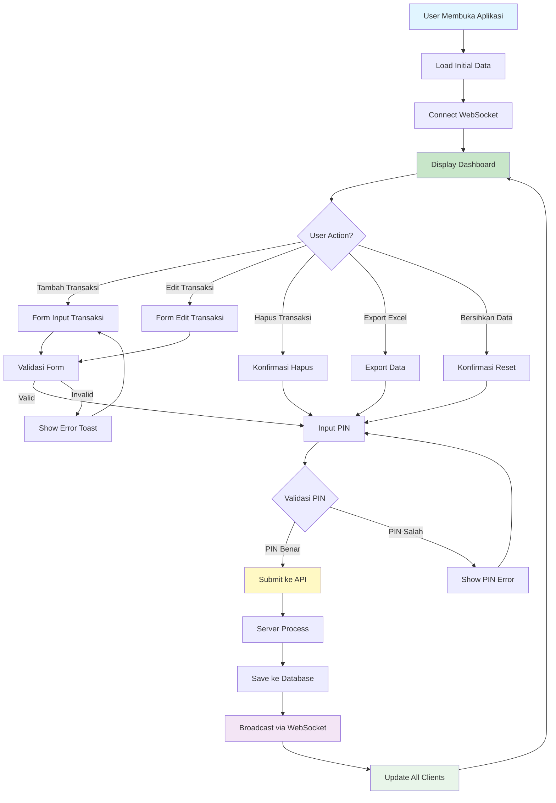
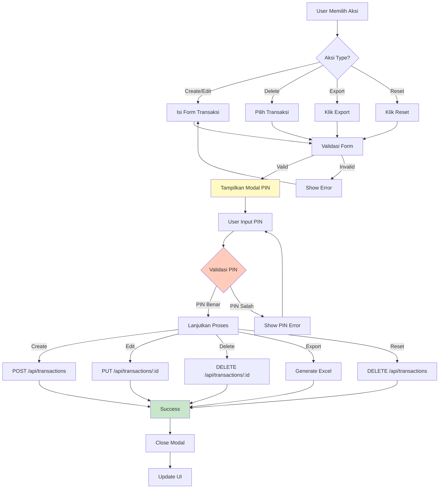
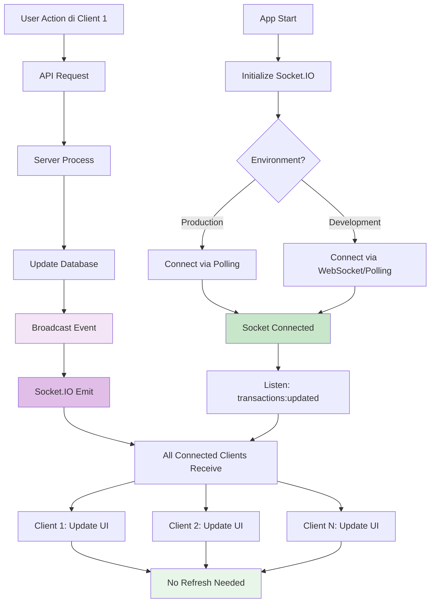
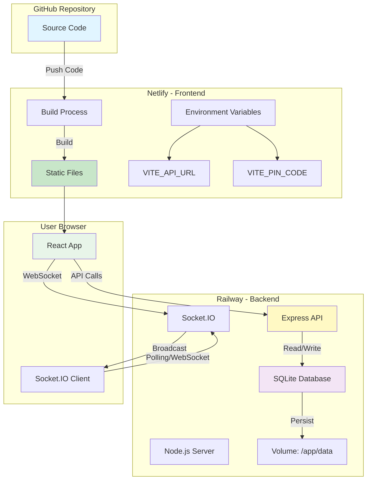
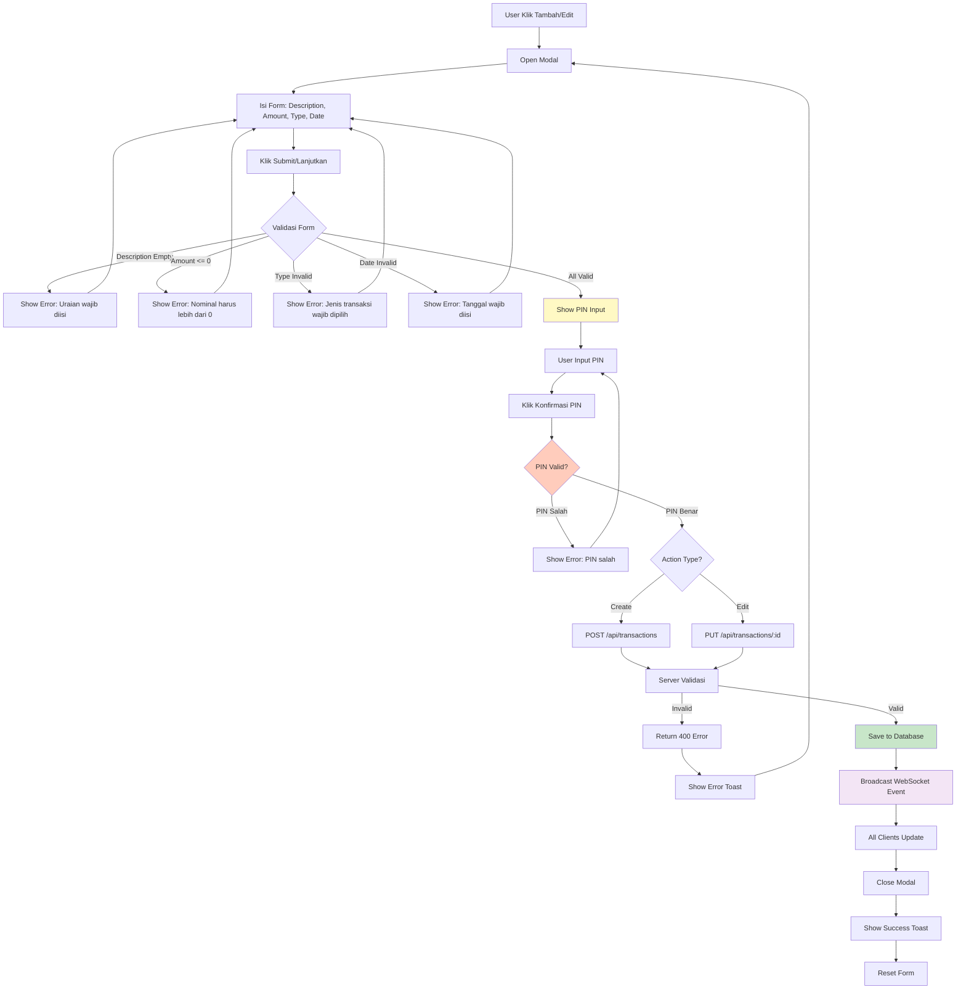
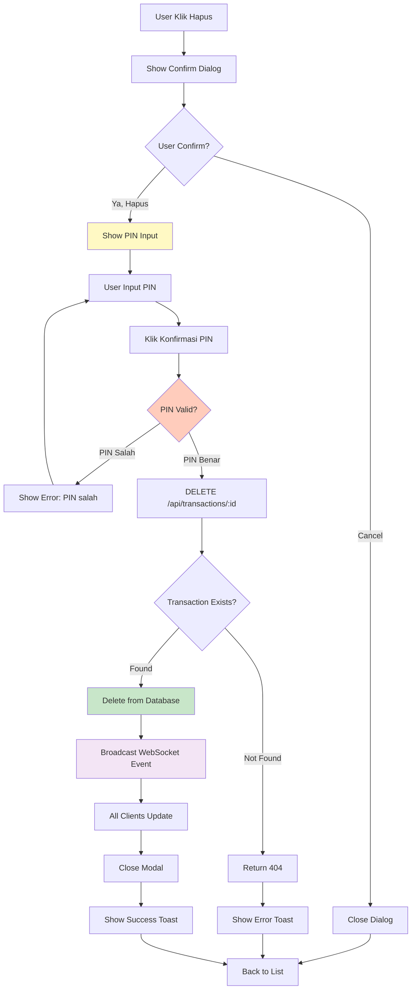
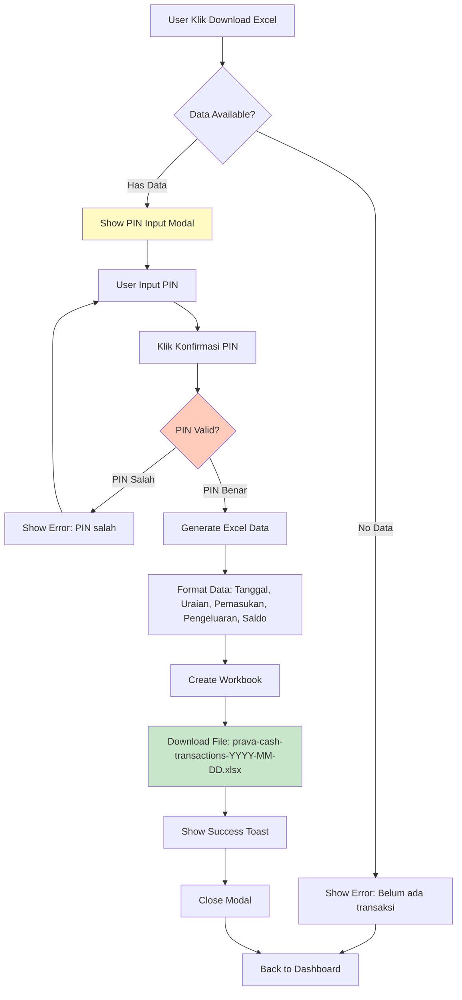
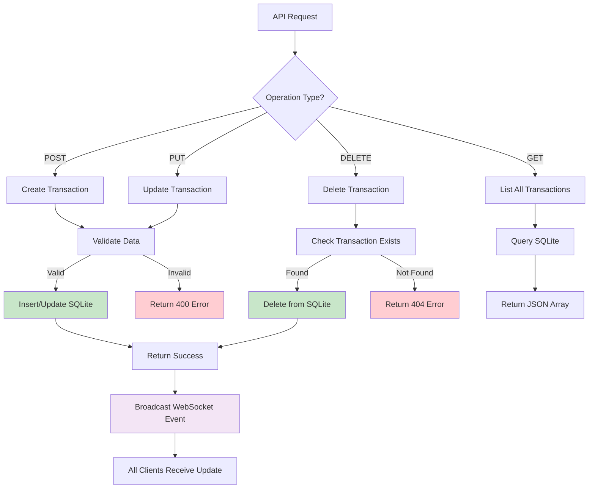
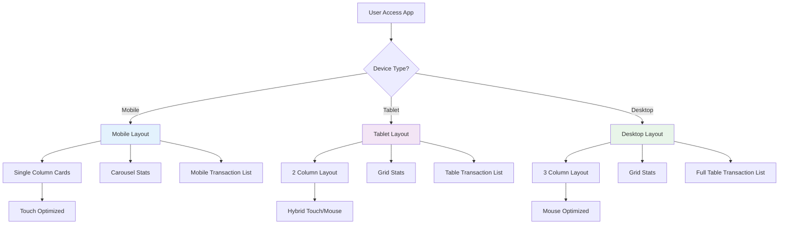

# Flowchart Prava Cash

Dokumentasi flowchart untuk aplikasi Prava Cash - Cashflow Management Dashboard.

## 📊 Flowchart Aplikasi Utama

## 🔐 Flowchart Autentikasi PIN

## 🔄 Flowchart Real-time Update (WebSocket)

## 🏗️ Flowchart Arsitektur Deployment

## 📝 Flowchart Proses Transaksi (Detail)

## 🗑️ Flowchart Hapus Transaksi

## 📥 Flowchart Export Excel

## 🔄 Flowchart Database Operations

## 📱 Flowchart Responsive Design

## 🚀 Flowchart Build & Deploy Process

```mermaid
flowchart TD
    A[Developer Push to GitHub] --> B[GitHub Webhook Triggered]
    
    B --> C{Service?}
    
    C -->|Frontend| D[Netlify Build]
    C -->|Backend| E[Railway Build]
    
    D --> F[Install Dependencies]
    F --> G[Read Environment Variables]
    G --> H[VITE_API_URL]
    G --> I[VITE_PIN_CODE]
    H --> J[Build React App]
    I --> J
    J --> K[Generate Static Files]
    K --> L[Deploy to CDN]
    
    E --> M[Install Dependencies]
    M --> N[Start Node.js Server]
    N --> O[Express + Socket.IO Running]
    O --> P[Connect to Database]
    P --> Q[Volume Mount: /app/data]
    
    L --> R[Frontend Live]
    Q --> S[Backend Live]
    
    R --> T[User Access App]
    S --> T
    
    style D fill:#00c7b7
    style E fill:#0b0d0e
    style R fill:#c8e6c9
    style S fill:#c8e6c9
```

## 📋 Legend

- 🟦 **Blue**: Start/Entry Point
- 🟩 **Green**: Success/Completion
- 🟨 **Yellow**: Process/Processing
- 🟪 **Purple**: WebSocket/Real-time
- 🟥 **Red**: Error/Failure
- 🟧 **Orange**: Validation/Check

## 📝 Catatan

1. **WebSocket**: Di production menggunakan polling karena Netlify tidak support WebSocket native
2. **PIN**: Dapat diatur melalui environment variable `VITE_PIN_CODE`
3. **Database**: SQLite dengan persistent volume di Railway
4. **Real-time**: Semua perubahan otomatis ter-update di semua client yang terhubung
5. **Responsive**: Aplikasi mendukung mobile, tablet, dan desktop

